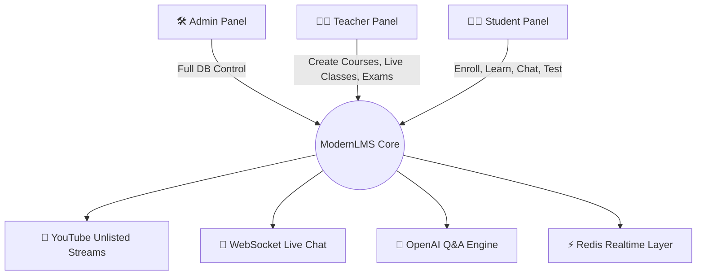

<div align="center">

# 🎓 ModernLMS

### *Online learning that actually feels like a classroom.*

A full-featured, modern Learning Management System built for live classes, real-time interaction, and effortless course management, without the storage headaches or clunky UI most LMS platforms suffer from.

<br/>


<br/>

</div>

---

## ✨ Overview

**ModernLMS** is a complete Learning Management System designed from the ground up to eliminate the friction of online education. It brings together **live broadcasting**, **real-time chat**, **AI-assisted Q&A**, **exams**, **discussion groups**, and a **premium, modern UI**, all wrapped in a clean, scalable architecture.

Built for three audiences:

| 👨‍🎓 Students | 👩‍🏫 Teachers | 🛠️ Admins |
|:---:|:---:|:---:|
| Learn, chat, test, and discuss | Broadcast, manage, and evaluate | Full database & platform control |

---

## 🧩 Smart Course Structure

ModernLMS organizes content in a clean, deeply nestable hierarchy:

```
📦 Course
 └── 📁 Subject
      └── 📂 Topic
           └── 🎬 Class
                └── 📎 Attachments (PDF / Slides / Links / Sheets)
```

> Scales cleanly up to **5+ nested levels**, powered by a dynamic, multi-level node system in the teacher panel.

---

## 🚀 Core Features

<table>
<tr>
<td width="50%" valign="top">

### 🎥 Live + Recorded Classes
Teachers can go **live** or upload **recorded** sessions, both pulled from **YouTube unlisted links**, keeping server storage requirements minimal.

### 💬 Real-Time Live Chat
WebSocket-powered chat inspired by YouTube Live, so students interact with teachers instantly during broadcasts.

### 👁️ Live Viewer Count
Teachers see exactly how many students are watching, live, right from their panel.

### 🎮 Interactive Video Experience
Keyboard controls, smooth playback, and a distraction-free viewing environment.

</td>
<td width="50%" valign="top">

### 📚 Dynamic Course Catalogue
Students only see courses they're enrolled in, with smart filters for easy discovery.

### 🧠 Advanced Teacher Panel
A multi-level node system for building complex course structures, managing lessons, and uploading attachments.

### 🌗 Dark Theme Toggle
Seamless light/dark switching across the entire platform.

### 💳 Automated Payments
Integrated payment flow for frictionless course enrollment.

</td>
</tr>
</table>

---

## 🆕 Latest Update

<div align="center">

### 🎒 Students Panel: New Features

</div>

| Feature | Description |
|---|---|
| 📝 **Exam Page** | Topic-based exams with a **server-side timer**, so refreshing the tab won't reset it. Previous attempts are viewable anytime. |
| 🆔 **Unique User ID** | Every user gets a unique **8-character numeric ID** for login. |
| 👤 **Student Profile** | Fully editable profile including personal, parent, and guardian info. |
| 🔴 **Live Class Section** | All ongoing live classes surface in one dedicated section. |
| 🤖 **Advanced Q&A** | Ask questions with image, PDF, or audio attachments, answered by a **human teacher or AI** (powered by the OpenAI API). |
| 👥 **Discussion Groups** | WhatsApp-inspired group chat, one per course. |
| ✅ **Solve Sheets** | Access published solve sheets per course. |

<div align="center">

### 🧑‍🏫 Teacher Panel: New Features

</div>

| Feature | Description |
|---|---|
| 📝 **Manage Exams** | Create, publish, and manage exams. |
| ✅ **Manage Solve Sheets** | Upload solve sheets by course, subject, and topic. |
| 🤖 **Q&A Service** | Respond directly to student questions. |
| 👥 **Discussion Access** | Monitor and message inside course discussion groups. |

<div align="center">

### 🌐 Public Page

</div>

- 🎨 **Premium & Modern UI**: vibrant gradients, clean lines, and a sleek layout designed for focus.
- 📱 **Fully Mobile Optimized**: app-like horizontal card layout with smooth navigation on any device.

---

## 🐛 Bugs Fixed

- ✅ Content node tree collapse issue
- ✅ WebSocket connection glitch
- ✅ Redis channel connection issue
- ✅ Unsupported dark theme rendering
- ✅ Miscellaneous CSS glitches

---

## 🏗️ System Roles at a Glance



---

## 🧰 Tech Highlights

- ⚡ Real-time communication via **WebSockets**
- 🧠 **Redis**-backed live channels
- 🤖 **OpenAI API** integration for automated Q&A
- 🎬 YouTube-based video delivery for minimal storage overhead
- 💳 Integrated automated payment system

---

## 📸 Screenshots

<div align="center">
<table>
<tr>
<td width="33%" align="center">
<b>Student Dashboard</b><br/><br/>

</td>
<td width="33%" align="center">
<b>Live Class</b><br/><br/>

</td>
<td width="33%" align="center">
<b>Teacher Dashboard</b><br/><br/>

</td>
</tr>
</table>
</div>

---

## 📬 Contact & Contribution

Contributions, ideas, and feedback are welcome! Feel free to open an issue or submit a pull request on the [ModernLMS repository](https://github.com/Astr4n0x/ModernLMS).

---

<div align="center">

**⭐ If you like this project, consider giving it a star on GitHub! ⭐**

*Built with passion to make online learning feel real.*

</div>
